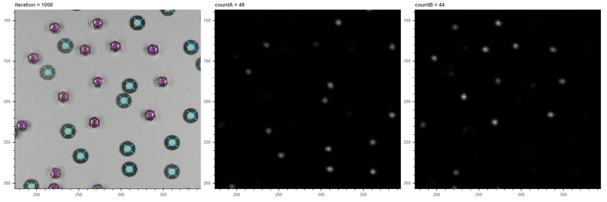

# 2classify
教師なしで２クラスの物体検出とクラス分けをします

## ドキュメント

* [教師なし物体検出についての実験まとめ(経緯)](https://samacoba.github.io/20220630report)
* [ガウス球へのドメイン変換による教師なし物体検出(レポート. markdown)](./docs/report.md)
* [ガウス球へのドメイン変換による教師なし物体検出(レポート. pdf)](./docs/report.pdf)
* [ガウス球へのドメイン変換による教師なし物体検出(スライド, pdf)](./docs/slide.pdf)

## 動作環境

- pytorch 1.9.0
- numpy 1.16.5
- Jupyter 1.0.0
- pillow 6.2.0
- scikit-image 0.15.0
- bokeh 1.3.4