# ガウス球へのドメイン変換による教師なし物体検出

2022/6/30 v1.00 
@samacoba 

## はじめに

ある画像に写った物体を検出するにおいて、手動で前処理を行うことで特徴を抽出した後、機械学習などによって物体を検出する方法や、最初から教師データを使ってEnd to Endで深層学習を行い、学習済みのモデルを使って物体の検出を行う方法が近年発展してきた。しかしながら、前処理や教師データの作成に人の労力が必要であるため、教師なし学習や弱教師あり学習など様々手法が提案されてきている。本論文では前処理なし・教師なしでの物体検出およびクラス分けに関する一つの手法の提案と、その手法に関してのいくつかの実験および結果について述べる。

本研究でのアプローチ方法(図0-1)として、最初から直接物体を検出するのを目指すのではなく、入力画像を一度検出しやすい画像に変換して、その後一定の処理で検出するという2段階の方策をとっている。本研究では入力画像から、黒背景に白いガウス分布状の球（以下「ガウス球」と略）が並ぶような「ガウス球画像」に一度変換する。その後、ガウス球の輝度のピークを一定の画像処理にて抽出することで、物体の位置を取得する。仮に入力の画像に応じて、ガウス球画像に変換できるような変換器（Converter）が自動で学習できるならば、全体として教師なしでの物体検出が可能となる。

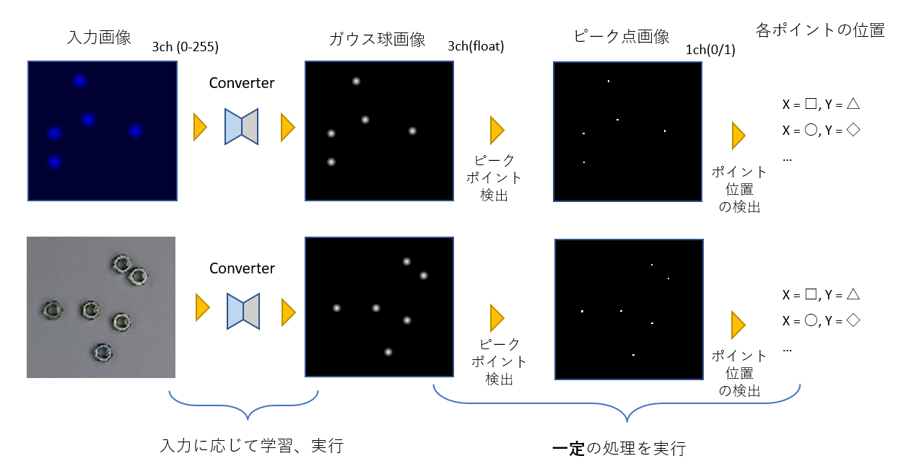 
&emsp;　　　　　　　　図0-1 アプローチ方法
  

本研究では入力画像1枚とランダムにガウス球を散在させた画像を用いる(図0-2)。入力画像とランダムガウス球画像の画素は 512pixel × 512pixel × 3ch(RGB) で今回すべての実験を行った。この2種類の画像を 64pixel × 64pixel の大きさに100枚ずつランダムに切り取り、Converterなどの４種類のDeep Neural Network を学習させる。当然、入力画像の物体の位置とランダムガウス球画像の白球の位置は一致していない。散布させるガウス球の数は重要なパラメータであり、入力画像の物体数と同オーダーの数を散布させた方が成功しやすい（1-1の実験を参照）。

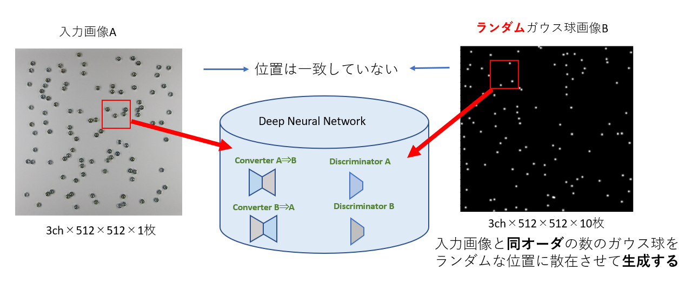 
&emsp;　　　　　　　　図0-2 学習に使う画像
  

Converterなどのネットワークの学習には、DiscoGAN[1]のドメイン変換の学習ネットワークをほぼそのまま転用している。ドメインAとして入力画像、ドメインBとしてガウス球画像とし、A⇒BとB⇒Aのドメイン変換をGANを使いながら教師なしで学習させる。４つのLoss（Reconstruction Loss A/B とGAN Loss A/B）を使って、２つのConverter と２つのDiscriminator を学習させる。学習前はConverter A⇒Bの出力はほぼ黒であるが、学習につれて入力画像と同じ位置にガウス球が出力(B#)されるようになる。このB#の画像を一定の処理によりピークの位置を検出する（補足参照）ことで、物体の位置を検出することができる。Converter A⇒B以外のConverter B⇒AやDiscriminator A/B は 学習には使われるが、物体検出時には使用しない。

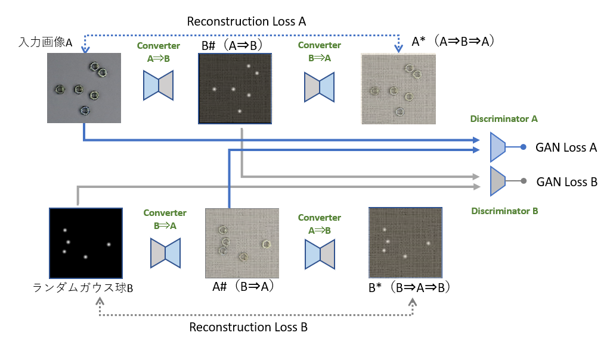 
&emsp;　　　　　　　　図0-3 ネットワークの学習
  

Converterのネットワークは4層のConvolutionと4層のDeconvolutionを重ねた形であり、1層毎にchを2倍し、解像度を縦横半分にしている。このほか最初と最後層の以外の層にはBatch Normalization、最後の層以外はLeaky ReLUを使用している。

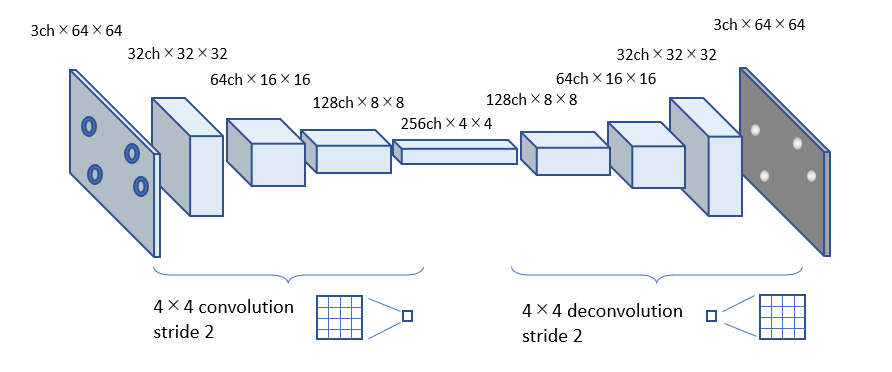 
&emsp;　　　　　　　　図0-4 ネットワークの詳細
  

## 1. 1クラス検出

1クラス検出のサンプル画像は図1-1のようにM3サイズのナットをサンプルとして使用している。ナットを白い紙にばらまき、ある程度ランダムになるよう「手で」配置している。撮影は上部からデジカメで撮影し、光源は斜め上からある程度均一になるように拡散版を介して照らしている。ただし、金属面の反射光の状態は中央と両端で若干異なる。ナット100個、50個、25個の3種類の写真を毎回ランダムになるよう並べ替えて5枚ずつ撮影した。

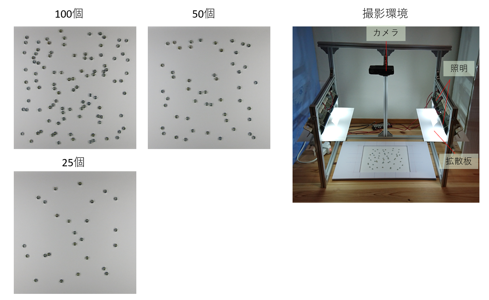 
&emsp;　　　　　　　　図1-1 サンプル画像
  

ナット100個に対して、ランダムガウス球の散布数を平均100個で学習したときの学習過程の例が図1-2である。イテレーション300回では出力B#はうっすら見える程度だが、徐々にはっきりしてきて2000回だとナット100個全部の位置にガウス球が出力されている（iter =2000時の出力B#のガウス球のピーク位置を検出して、入力Aに対し水色の×を重ねてある）。イテレーション300回ではナットの光の反射による輝度の違いから弱い部分もあるが、最終的に全部のナットが検出されている。

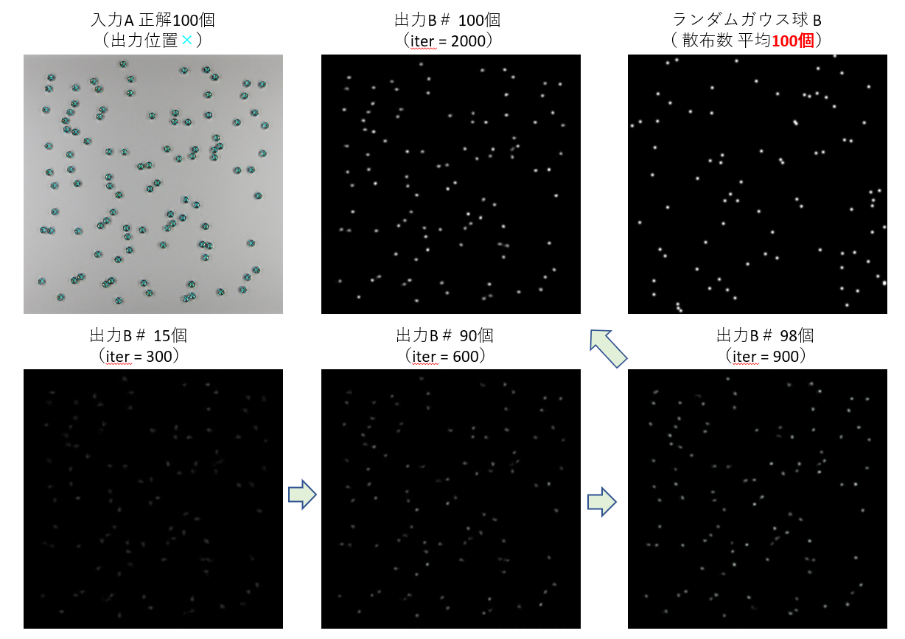 
&emsp;　　　　　　　　図1-2 学習過程
  

図1-3は学習の失敗例である。散布数を平均300個とした場合、実際100個あるナットよりも過剰であるため、１個のナットに対し複数のガウス球の出力が見られる。散布数を平均40個とした場合、実際100個あるナットよりも少ないため、ガウス球の出力数も少ない状態が見られる。

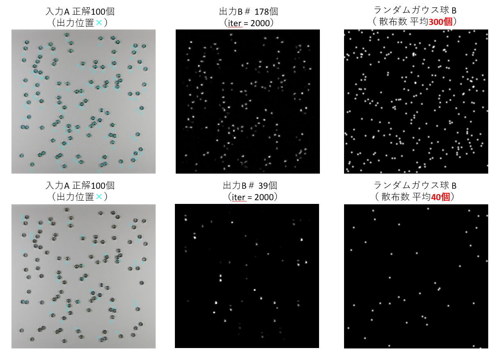 
&emsp;　　　　　　　　図1-3 学習失敗例
  

評価方法として、図1-4のように、正解位置（実際ナットがある位置）と出力位置の関係から「OK」と「NG」に以下のように判定する。

1. 正解位置を基準として、一番近い正解位置同士を等分するような線を引き、線に囲まれた区画を「セル」と呼ぶ
2. 各出力位置に対し、どのセルに属するかを判定する
3. セル内に出力がない場合は「ゼロ」としてNGとする
4. セル内に２個以上ある場合は「２個以上」としてNGとする
5. セル内に１個かつ距離dlim = 8pixelより大きい場合は「範囲外」としてNGとする
6. セル内に１個かつ距離dlim = 8pixel以内の場合はOKとする

正解位置のデータに関しては、複数の出力結果の内、ある程度学習が成功している結果を目視で選択し、その平均の画像から正解位置のデータを作成した。

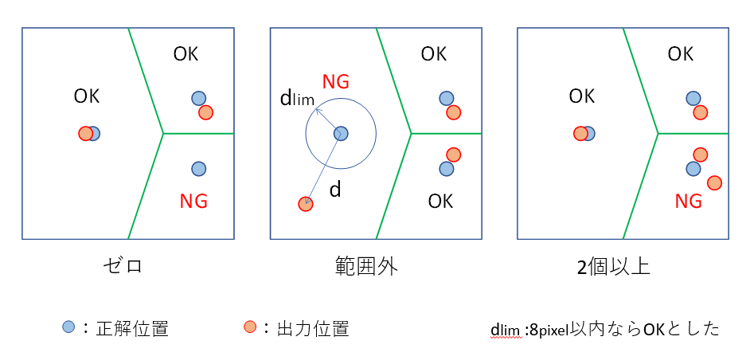 
&emsp;　　　　　　　　図1-4 評価方法
  

### 1-1. ガウス球の散布数と出力の関係

ランダムに散在させたガウス球の数（散布数）は事前に与える必要があるパラメータであり、どの程度の範囲で検出が成功するかについて実験を行った。 
写真のサンプルはナット100個、50個、25個の3種類について、各5枚ずつ使用した。各サンプルに対して、ガウス球の散布数の平均は、以下の範囲で実験を行った。同じ写真、同じ散布数で20回学習を繰り返した。

* 実際100個のナットに対して、散布数を20～300個
* 実際50個のナット対して、散布数を10～150個
* 実際25個のナット対して、散布数を5～75個

図1-5 に散布数と出力の関係の結果を示す。この結果は例えばナット100個の場合、5枚×20回×100セルに対する平均の割合を表している。ナット100個を見ると、散布数が60個まで「ゼロ」がある程度占めており、80～200個程度まで80%程度が「OK」であり、200個あたりから「2個以上」が増える傾向がある。ナット50個、25個についても同様の傾向があり、おおむね実際の数に対して100%～200%程度の散布数で良好な結果となっている。出力の球数と散布した球数が大きく異なると、Discriminator側が判定しやすくなるため、Converter側が無理やり差を小さくしようと学習し、出力数が散布数に寄ってしまうものと考えられる。

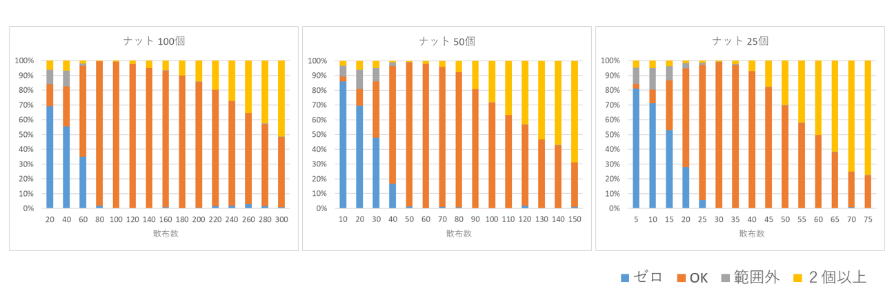 
&emsp;　　　　　　　　図1-5 散布数と出力
  

散布数は実際の数に対して100%～200%程度ならある程度学習が成功するが、オーダーを間違えると学習は失敗しやすい。このため、散布数のオーダーを自動で決定できる方法があれば、より人間の関与は少なくできる。同じ画像、同じ散布数にて、複数回学習を試した場合、学習に成功した場合は出力位置のブレは小さいが、学習に失敗した場合は位置のブレは大きくなりやすい。この傾向から、出力の位置のブレの大きさを測る方法として、以下のように出力画像と平均出力画像に対するR2の計算を行った。

1. 各画像・各散布数に対して、20回学習を行う
2. 各出力結果に対し、検出位置を求める
3. 黒背景に対し、検出位置にガウス球を再配置した出力画像（out）を作成
4. 20回のoutを平均し、平均出力画像(out-ave)を計算
5. 各outとout-aveを一次元化し、R2を計算
6. 20回分のR2を平均し、R2-aveを計算

検出位置がすべて同じならば、各outとout-aveが同じになるので、各R2はすべて1となり、R2-aveも1となる。仮に1回だけ学習を失敗した場合、そのoutはout-aveと大きく異なるため、R2も小さくなる。「3.」の検出位置にガウス球を再配置したのは、球のコントラストを上げるために行った。0～1で評価できるなどから今回はR2を使用したが、他の評価方法でもブレの大きさを測ることは可能と思われる。

図1-6では、各散布数に対し、上段は正解データを使用せず、出力のみから計算したR2の結果と、下段は正解データから出力位置を評価し、OKの割合を計算した結果を示す。この結果は各画像・各散布数での20回学習した平均をプロットしている。上段と下段のピークはおおむね一致しており、正解データがない状態でもR2の計算により最適な散布数を推定できる可能性がある。ただし、今回一つの画像に対して、散布数 15水準 × 各20回 の計300回学習しており、計算量が膨大となっている。

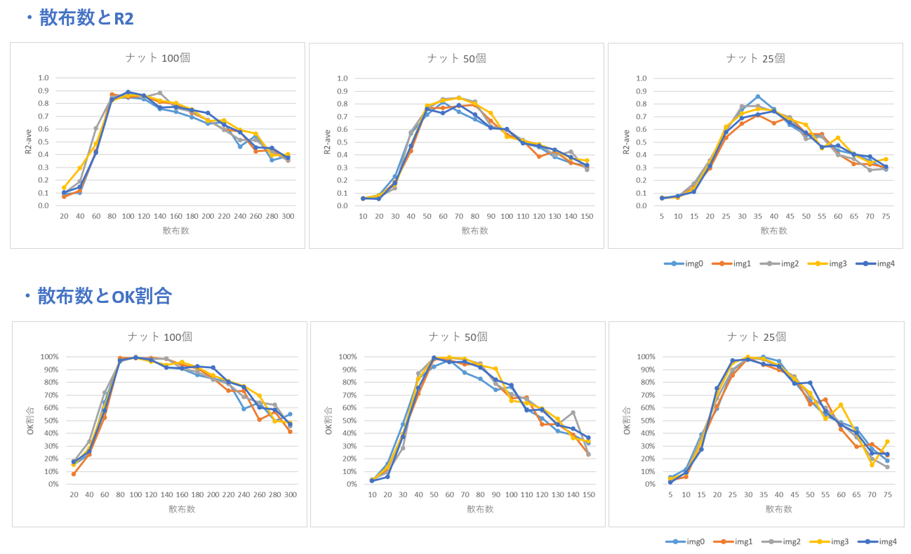 
&emsp;　　　　　　　　図1-6 R2による評価
  

### 1-2. 教師ありとなしの比較

本実験では、今回のランダムにガウス球を散布する教師なしの方法と、正解位置を与えて学習させる教師ありの方法の比較を行う。サンプルは100個のナット画像の5枚であり、各条件にて20回学習を行った。教師なしの散布数は平均100個とし、その他条件は1-1の実験と同じ条件で行った。教師ありについてはConverter A⇒Bのみを使用し、正解位置にガウス球を配置した正解画像と出力B#間をL2ロスにて学習を行った。

学習に使う画像と評価に使う画像に関して、教師なしの場合は位置情報を与えてないので、学習画像と評価画像が同じでも問題はないが、教師ありの場合は一般的には学習画像と評価画像は異なる。今回、5枚の画像を使用しているが、1枚の画像で学習したモデルを使って、5枚分評価を行った。例えばimg0で学習した場合、評価画像がimg0は学習画像=評価画像であり、評価画像がimg1～img4は学習画像≠評価画像となる。

表1-7は教師なしと教師ありにて、それぞれの画像での学習と評価をし、OKの個数を20回の学習で平均したもの示している。実際は100個のナットなので、100となればすべてOKとなっている。評価平均に関して、学習＝評価は1枚分、学習≠評価は4枚分の平均となっている。結果をみると、教師なしは教師ありに近いレベルでモデルが学習できている。また、教師なしにおける学習＝評価と学習≠評価の差は小さく、同様の環境であれば、一度学習したモデルを他のサンプルに対しても使用可能となっている。

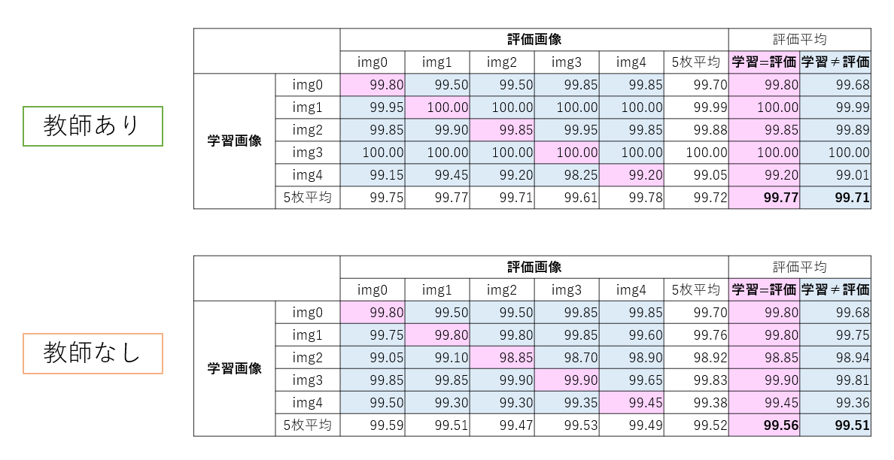 
&emsp;　　　　　　　　図1-7 教師ありとなしの比較
  

### 1-3. ロスの影響度

今回の方式において、どのロスの影響が大きかについて実験を行った。図1-8 は4つのロスの内、いくつかのロスの値をゼロにして、学習を行った結果である。ロスをゼロとすれば、そこから学習はされないため、仮に重要なロスであれば学習がうまくいかなくなることが予測される。ロスをゼロにしたものを「×」とし、ロスをそのまま使ったものを「○」としてある。サンプルは100個のナット画像5枚を20回ずつ学習し、散布数は平均100個とした。評価において、平均OK割合については5枚 × 20回 × 100セルに対してのOKであった割合であり、画像全体としては十分に学習できてない場合が含まれる。これに対し、OK90%以上は5枚×20回中OKが90%以上（90セル以上OK）の枚数としており、画像全体として学習できている場合に近い評価となっている。

OK90%以上が比較的高い5サンプルを学習成功としてグリーンで色分けしてある。5サンプルの内GAN Bのロスはすべて○であり、学習にGAN Bが必須であると考えられる。これはConverter A⇒Bの学習において、ガウス球に似せる変換は重要なためだと考えられる。逆にGAN Aは○が2/5であり、学習には必須ではないと考えられる。これはConverter B⇒Aの学習における、ナットに似せる変換はあまり重要ではないためと考えらえる。Recon AとRecon Bのどちらかが○でないと学習がうまくいかない。これは復元による位置の保存する効果が関係する可能性がある。また、学習はRecon A よりRecon B の方が比較的うまくいくが、学習のバランスで大きく変わることもあり、要因の分析は難しい。

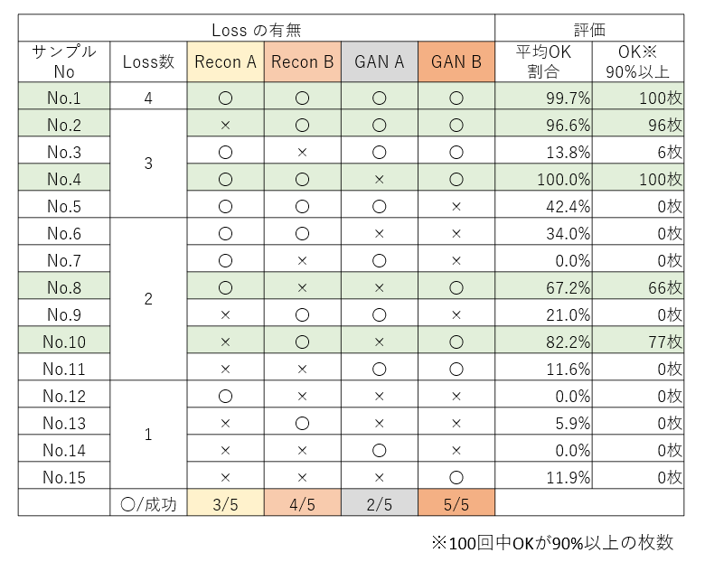 
&emsp;　　　　　　　　図1-8 Lossの影響度
  

## 2クラス検出

2クラス検出では2種類の物体の検出の実験を行う。図2-1は実験で使用した5種類のサンプルの拡大写真である。

* YG/BG球[7:3]（CG生成）黄緑球(R:G:B = 7:10:3) / 青緑球(R:G:B = 3:10:7)　平均50個 / 平均50個
* YG/BG球[6:4]（CG生成）黄緑球(R:G:B = 6:10:4) / 青緑球(R:G:B = 4:10:6)　平均50個 / 平均50個
* mesh 1pix/2pix（CG生成）1ピクセル毎 / 2ピクセル毎 のパターン　平均50個 / 平均50個
* beads 青/赤（写真）　青ビーズ / 赤ビーズ　50個 / 50個
* nut / washer（写真）　M3ナット/ M3ワッシャー　50個 / 50個

CG（Computer Graphics）生成のサンプルは、白色のガウス球と同様の方法（補足参照）で生成しており、平均として50個ずつ生成している。また、CG生成は100枚生成し、各1回ずつ学習、写真は5枚用意し、各20回ずつ学習した。学習の難易度を調整するため、YG/BG球[7:3]とYG/BG球[6:4]の2種類作成した。色の違いは[6:4]の方が小さく、学習が難しくなっている。mesh 1pix/2pixに関しては白色のガウス球に対し、1ピクセル毎又は2ピクセル毎に1.5倍と0.5倍の輝度になるようパターンを掛けて作成してある。

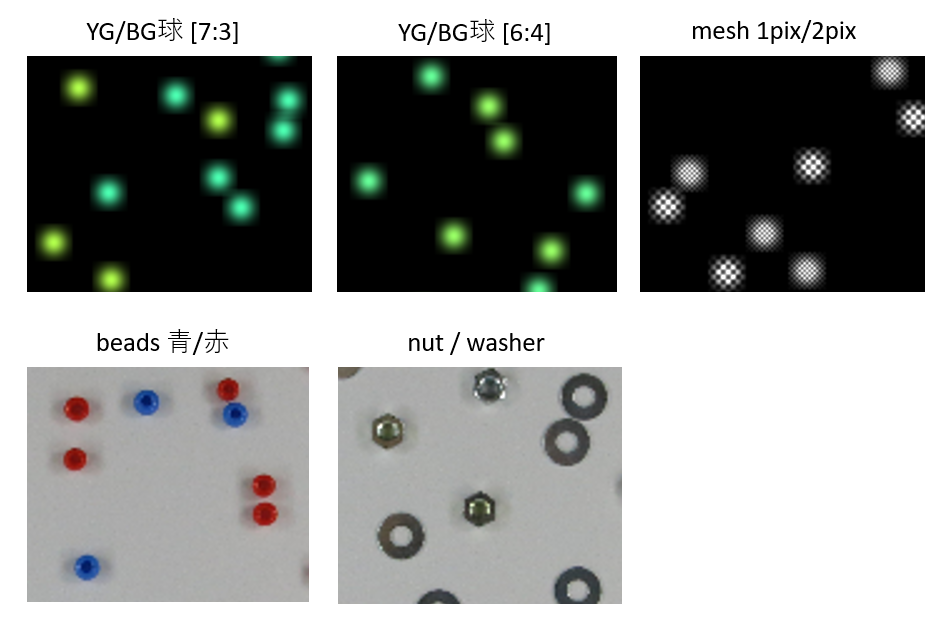 
&emsp;　　　　　　　　図2-1 2クラス用サンプル
  

1クラス検出から2クラス検出にタスクを変更するにおいて、出力は2クラス分に必要になってくる。図2-2のように、1クラス検出では出力は3ch(RGB)だが、2クラス検出では3ch × 2枚の出力になるようなネットワーク構成としている。また、2クラス検出では、ランダムガウス球側も3ch × 2枚発生させて、Discriminatorの判定に使うようにしてある。ランダムガウス球の散布数は2枚とも平均50個として実験を行った。ここでは2クラス検出のネットワークの例として、後述の「③ 2分岐 6ch-Dis」を示してあり、3ch × 2枚の出力の画像を重ねた6chにて、Discriminatorの判定を行っている。

2クラス検出の評価において、例えばnut/washerでは3ch × 2枚の出力(1-3ch/4-6ch)の内、どちらがナットでどちらがワッシャーにあたるかに関して事前に決まっておらず、1-3chがナット、4-6chがワッシャーの場合と1-3chがワッシャー、4-6chがナットの場合がありうる。このため、評価方法としてそれぞれのchをナットとワッシャーでOK数を評価して、合計のOK数が多い組み合わせを使って全体の評価をしている。

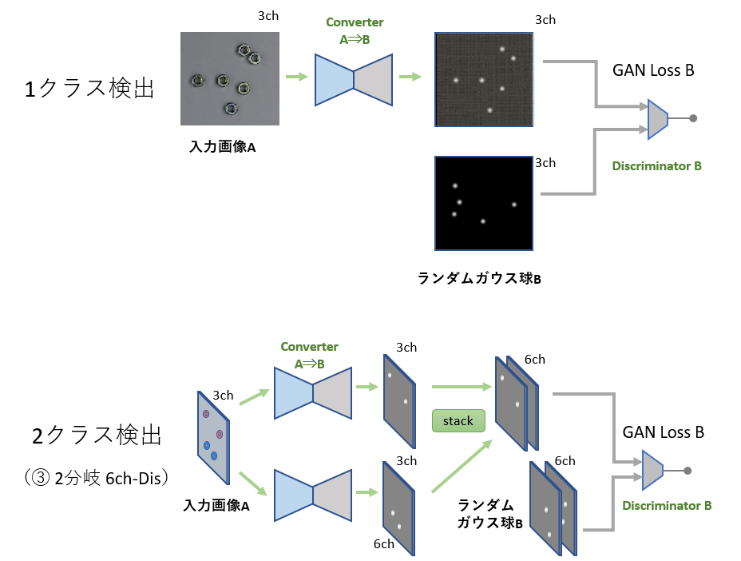 
&emsp;　　　　　　　　図2-2 1クラス検出と2クラス検出の比較
  

図2-2では「③ 2分岐 6ch-Dis」のネットワークの一部のみを示したが、図2-3 では「③ 2分岐 6ch-Dis」 の全体のネットワークを示す。

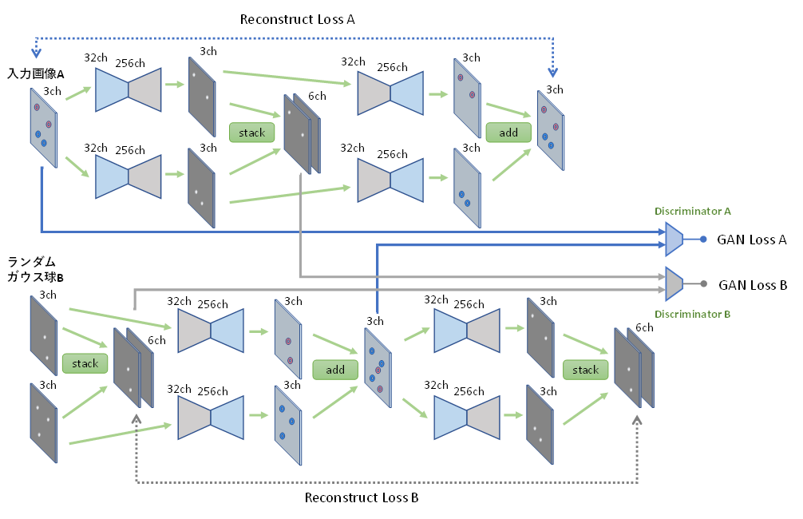 
&emsp;　　　　　　　　図2-3 2クラス検出 ③ 2分岐 6ch-Dis の全体
  

### 2-1. 中間チャンネルと分岐の効果

本実験では、図2-4のように、1クラス検出でのネットワークの出力側を単に3ch ⇒ 6chにした場合の「➀1系統 中間ch1倍」、➀の中間チャンネル数を2倍にした「➁1系統 中間チャンネル2倍」、1クラス検出のネットワークを2分岐させた「➂2分岐 6ch-Dis」の3種類について比較を行った。➂＞➁＞➀の順でよい結果となっており、➂の2分岐で学習させたものが一番うまく学習できている。➀と➁では、➁の方がch数が多く表現力が高いためよい結果になったと考えらえる。➁と➂を比較すると中間のch数は合計で同じではあるが、➁の方が中間でのCCNの計算量は多い。しかしながら、➂の分岐させた方が学習には有利となる結果となった。

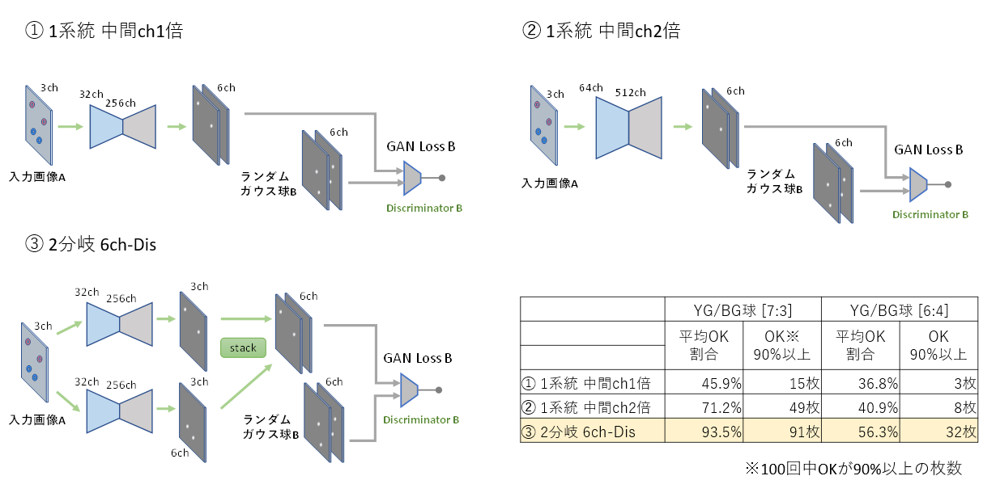 
&emsp;　　　　　　　　図2-4 中間チャンネルと分岐の効果
  

### 2-2. Discriminatorのチャンネル数と重みの共有

本実験では、図2-5のようにDiscriminatorを2つずつ使用した「➃2系統独立」と「➄2分岐 3ch-Dis」および、一部の重みを共有した「➅2分岐 重み共有」について比較を行った。「➃2系統独立」は上側と下側のネットワークが完全独立しており、別々に2回学習したものと同じ条件になっている。「➂2分岐 6ch-Dis」では、Discriminatorは3ch × 2枚の画像で判定を行っているのに対し、「➄2分岐 3ch-Dis」では、Discriminatorは3ch × 1枚の画像で判定を行っている。➂のようにDiscriminatorが2枚分で判定する場合、同じ位置にガウス球があると偽物と判定しやすい。このため、2系統のConvertorは出力位置が重なるのを抑制しようとする効果が期待できる。これに対し、➄のように1枚分で判定する場合、そのような効果は期待しにくい。➃と➄ではこの図(A⇒B)では似ているが、全体のネットワーク(A⇒B⇒A)における後半部分(B⇒A)にて、➄ではAに復元されるときに足して(add)復元し、原画像とReconstruct Lossを取っている。➃では足さずに2系統それぞれ、原画像とReconstruct Lossを取っているので、2系統間でロスが伝播することはない。「➅2分岐 重み共有」はA⇒X(中間)⇒B内のX⇒Bにて2系統間で同一のネットワークを使用し、B⇒X(中間)⇒A内のB⇒Xにて2系統間で同一のネットワークを使用している。X(中間）⇔B（ガウス球）の変換に関して、個別に学習する必要性は必ずしもないと考えられ、共有ができればモデル容量は少なくできる。

結果は「➂2分岐 6ch-Dis」が総じてよい結果となった。➂の方が、「➃2系統独立」の2つのネットワークを別々に2回学習するより良くなっている。また、「➄2分岐 3ch-Dis」と➂では、おおむね➂の方がよく、Discriminatorが3ch × 2枚の画像で判定した方がうまくいきやすい。YG/BG球は2種類の物体が対称的に作られているのに対し、meshやbeads, nut/washerは2種類の物体は非対称である。2種類の物体が非対称での場合、2つのネットワークが、検出しやすい方の物体に偏って同じ物体を検出してしまうことが多くなる。➃・➄に比べ、➂がよい要因としてDiscriminatorが3ch × 2枚の画像で判定することで、2つのネットワークが同じ物体を検出するのを抑制したことが考えらえる。YG/BG球では➄の方が良い結果となっているが、物体が対称的であったことによる可能性がある。➄と「➅2分岐 重み共有」では➄の方がよい結果ではあるが、➅でもある程度学習できていることから、ネットワークの共有は可能であると考えられる。

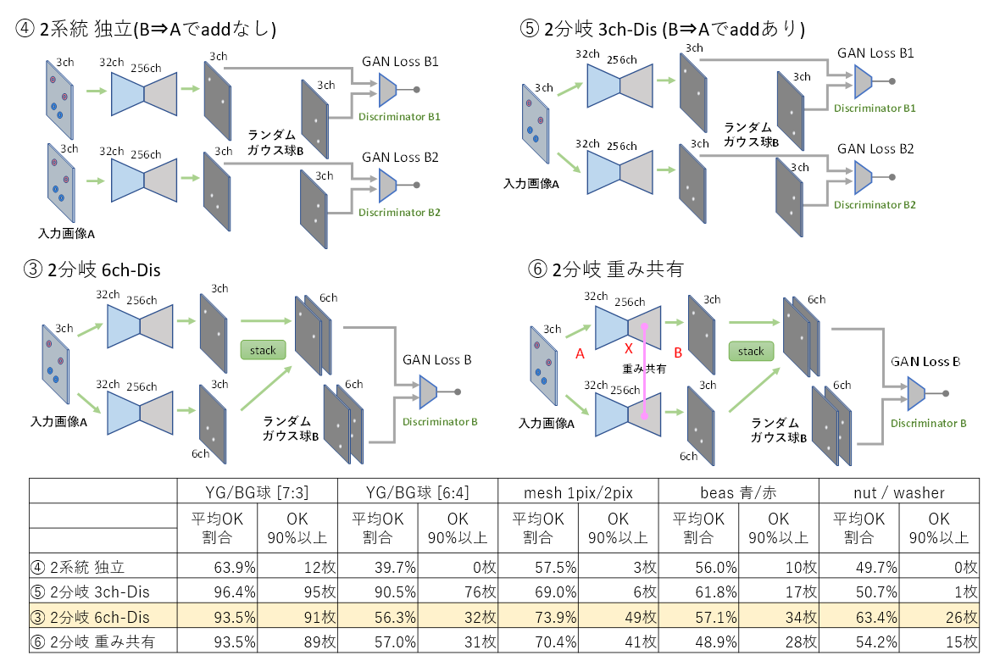 
&emsp;　　　　　　　　図2-5 Discriminatorの独立性
  

### 2-3. 2クラス結果の出力例

以下に2クラス検出における「➅2分岐 重み共有」で学習させた時のおおむね成功した出力結果の例をいくつか示す。

図2-6はYG/BG球の結果の出力例である。左側は入力の画像であり、1-3chの出力位置を水色の×、4-6chの出力位置をピンクの×で重ねてある。中央が1-3chの出力、右側は4-6chの出力となっている。上段の[7:3]の方は1-3chの出力が青緑球、4-6chの出力が黄緑球とほぼ一致している。下段の[6:4]の方は1-3chの出力が黄緑球、4-6chの出力が青緑球とおおむね一致している。だたし、黄緑球が2個近接した部分に関して、1個分しか出力されていない部分があり、正解の数より出力は4個すくない。

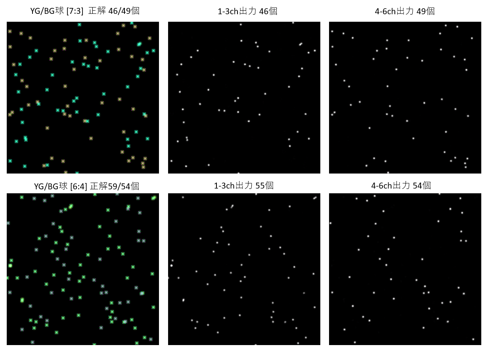 
&emsp;　　　　　　　　図2-6 2クラス 出力結果例 YG/BG球
  

図2-7はmesh 1pix/2pixの出力結果例である。上段は全体、下段は一部拡大したもので、1ピクセル毎と2ピクセル毎のパターンを学習できている様子が確認できる。

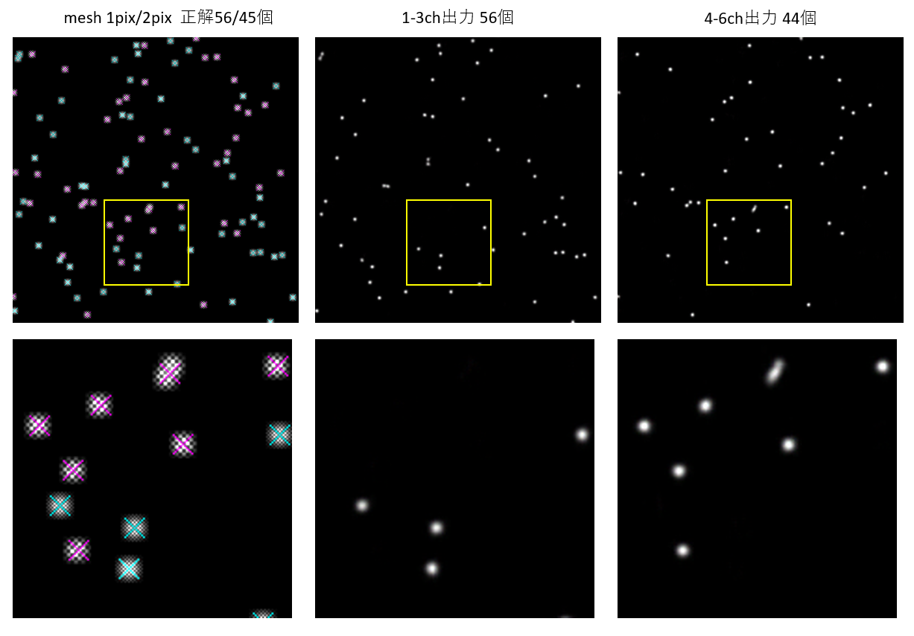 
&emsp;　　　　　　　　図2-7 2クラス 出力結果例 mesh 1pix/2pix
  

図2-8はbeads 青/赤 と nut / washer の出力結果例である。写真であっても2クラスの物体を分けて学習できている様子が確認できる。

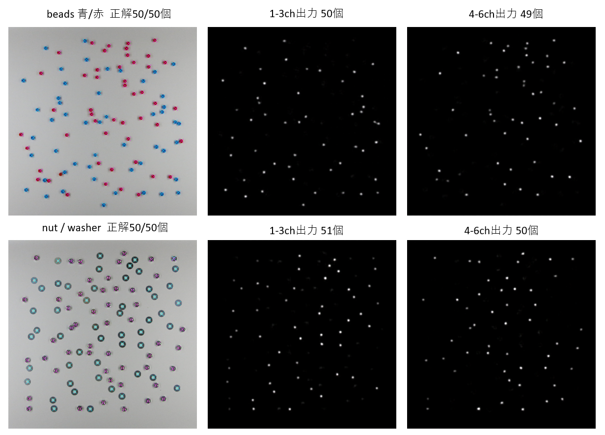 
&emsp;　　　　　　　　図2-8 2クラス 出力結果例 beads 青/赤, nut/washer
  

## まとめ

本研究ではDiscoGANを用い、ランダムに散布させたガウス球とのドメイン変換を学習することで、教師なしでの物体検出を試み、1クラスと2クラスの数種のサンプルにおいて物体検出ができた。また、本研究の提案手法の特性について、以下のような知見が得られた。

＜1クラス検出＞  
・散布数と出力数  
⇒ 散布数は正解数の1～2倍の範囲で比較的よい結果となった  
・教師の有無について比較  
⇒ 教師なしは教師ありに近いレベルでモデルが学習できた  
・ネットワークのロスの影響  
⇒ GAN Bは必須であり、GAN Aは必須ではない結果となった

＜2クラス検出＞  
・チャンネル数と分岐の効果  
⇒チャンネルを2倍にするよりも、２分岐させた方がよい結果となった  
・Discriminatorのチャンネル数  
⇒3chよりも6chでDiscriminatorの判定をした方がよい結果となった  
・2クラス結果の出力例
⇒色の違いやパターンの違い、写真において2クラスの物体を分けて検出できる様子が確認できた

[1]Taeksoo Kim, et al. "Learning to Discover Cross-Domain Relations with Generative Adversarial Networks", ICML(2017)

## 補足

### 計算環境

* 機械学習ライブラリはPyTorchを使用
* GPUはRTX2080,又はRTX A4000を使用
* 1回の学習時間はRTX A4000、２クラス検出の「➂2分岐 6ch-Dis」にて210秒程度

### ランダムガウス画像の生成

ランダムガウス球画像の球の数は固定ではなく、平均値で与えている。具体的には512pixel × 512pixelに0-1の一様な乱数を生成し、閾値t以上のポイントに対し、ガウス球を配置している。閾値tと、球の散布数Sは次の式の関係となっており、例えば散布数Sが100個なら、平均100個のガウス球が生成される。また、実画像と違い、閾値以上のポイントが近い場合、ガウス球は重なることがある。

* 1 - t =  S / (512 × 512)

1回の学習には最初に512pixel × 512pixelのガウス球画像を10枚分生成して学習を行う。ランダムガウス球は1chでも学習はできないわけではないが、安定のため3ch(RGB)で生成している。ガウス球の輝度Lは以下のようなガウス分布をしている。RGBの3chは同じ輝度としている。

* L = 255 × exp(-(r × r)/9) 　　r：ピークの位置からの距離(pixel) 

2クラス検出のCG生成した入力サンプル画像(YG/BG球など）のガウス球は以下のような分布とした。

* L = I × 255 × exp(-(r × r)/25) 　　r：ピークの位置からの距離(pixel) 
I：色やパターンによる強度（例：⻩緑球(R:G:B = 6:10:4)のRの場合 I=0.6）

### 学習時の画像

学習時、入力画像は1枚から、ランダムガウス画像は最初に生成した10枚から、64pixel × 64pixel の大きさに100枚ずつランダムの位置に切り取り、さらに回転と上下左右反転をランダムに行っている。100枚のバッチで学習しており、イテレーション毎に100枚ずつランダムに切り取って学習している。全実験イテレーション数は2000回とした。

### ピークポイントの検出

ガウス球画像の白球のピークの位置を検出する方法に関して、図4-1のようにmax pooling後にA*(A==B)の演算をすると、ピークの位置が抽出できる。max poolingの大きさによってピーク位置を探索する範囲が決まるが、本研究では9×9のMax poolingを使用した。また、ピークの検出には閾値を儲け、3chの輝度の平均が 255 × 0.2 = 51以上のみを検出することとした。

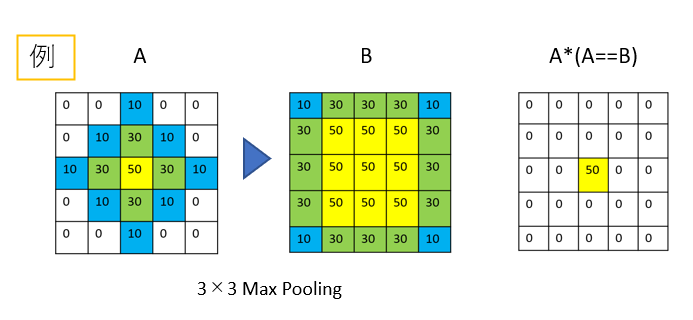 
&emsp;　　　　　　　　図4-1 ピークポイントの検出例 
  

### その他実験

ここでは詳細な実験は行っていないが、いくつか試した実験について記載しておく。

#### 背景の違い

本文の実験では背景に白い紙を使用したが、黒い紙やワッフル模様の布のような背景であっても物体の検出は可能であった

#### 少ない数での検出

本文の実験では最小で25個の検出であったが、1個だけや2クラス × 2個でも検出は可能であった。

#### 3クラスでの検出

本文の実験は2クラスまでの検出であったが、3種類のビーズにて3クラス検出もネットワークを3系統にすることにより可能であった。

